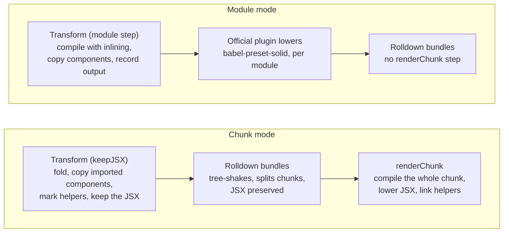

# Build phases

How `solid-optimizer/vite` turns a Solid app into optimized chunks. It wraps the official plugin, `vite-plugin-solid`, hooks into its `transform`, and adds its own `renderChunk`. This branch targets Solid 1; the Solid 2 branch wraps `@solidjs/vite-plugin` instead.

## Two modes

| Mode        | Used for                                                         | Where components inline                                     | Where JSX is lowered          |
| ----------- | ---------------------------------------------------------------- | ----------------------------------------------------------- | ----------------------------- |
| Chunk mode  | Client builds that do not hydrate                                | Across modules before bundling, then anywhere in each chunk | `renderChunk`, once per chunk |
| Module mode | Hydrating client builds, server builds, dev with `optimizer.dev` | Within each module, plus copies from other modules          | `transform`, once per module  |

Chunk mode sees more code at once, so it inlines more. Module mode keeps each module's output independent of how chunks split, which hydration needs: the server and client builds must render the same tree. `optimizer.mode: 'module'` forces module mode. The optimizer is off while serving unless `optimizer.dev` is set.

## The compile pipeline

Every phase calls the same `compile()`: four passes in a fixed order, repeated until a round changes nothing, at most 10 rounds (`maxPasses`). Each pass parses the code afresh, edits it with MagicString, and adds a source map that chains onto the last.

1. **Fold** evaluates constants, including those imported from other modules (`importedConstants`), resolves control flow whose outcome is known (`<Show when={true}>`, `<Switch>`, `<For>` over constants), and drops unreachable code.
2. **Inline** replaces component calls with the component's JSX, reading props directly or through `mergeProps()` and `splitProps()` views. It only inlines a component where its copies are no larger than what they replace. See [Size-aware inlining](#size-aware-inlining).
3. **Remove providers** drops a context provider, `<Ctx.Provider>`, when every reader below it is visible, giving each read the provider's value.
4. **Inline memos** replaces a `createMemo` that is read only once with its expression. A memo read more than once stays.

One round often opens work for the next: an inlined component's constant props fold, and a folded branch frees a provider. Server builds then run `simplifyServer` once, which removes effects and reduces reactive primitives to what they do on the server.

## Chunk mode

Chunk mode keeps JSX through bundling, so each chunk is optimized as one scope and lowered once. It runs in three phases.

### 1. Transform each module (`keepJSX`)

This replaces the official plugin's transform.

1. Read the constants of imported modules that have no JSX, through `this.load`, so another plugin's output is what folds.
2. Compile without inlining: fold, remove providers, inline memos. A branch that folds away takes its imports and `lazy()` chunks out of the module graph, which only this phase can do.
3. Rewrite `<Ns.Member>` tags of a namespace import to named imports, so Rolldown does not build a namespace object.
4. Copy components imported from other modules in, and inline them. See [Components from other modules](#components-from-other-modules).
5. Export the local bindings that exported components need under `__so_local$name`, so another module's copy can import them. Entries get none.
6. Lower the module in a dry run, as written and with its own components inlined, to learn which runtime helpers its JSX needs. A `__SOLID_OPTIMIZER_KEEP__` marker in each top-level function that holds JSX names them, so Rolldown keeps those helpers while the JSX is unlowered.
7. Return the JSX. Vite strips the types, and a small follow-up plugin restores the parentheses oxc drops around comma expressions in JSX.

### 2. Bundle

Rolldown resolves, tree-shakes, and splits chunks, with `jsx: 'preserve'` so JSX survives. A component copied into every module that used it is gone by now, along with what only it needed.

### 3. Render each chunk (`renderChunk`)

1. Read the markers: the helpers each part of the chunk needs, and the names Rolldown gave Solid's built-ins. `Show` may be `Show$1`, or a local declaration.
2. Compile the whole chunk, with top-level `var` treated as a constant (`constantVars`), since Rolldown turns `const` into `var`. Any component in the chunk inlines anywhere in it.
3. Lower the JSX with `babel-preset-solid`, and link the helper imports to the runtime's exports.
4. If the merged tree needs a helper no module asked for, warn and lower the chunk as written instead.

## Module mode

Module mode optimizes each module in its own `transform`, an `enforce: 'pre'` plugin, then hands it to the official plugin, which lowers it as usual. Nothing runs at `renderChunk`.

1. Read imported constants, as in chunk mode.
2. Compile the module with every pass, inlining included. A server build passes `server`, so `simplifyServer` runs too.
3. Copy components from other modules in and inline them. The code to copy from is each module's own module-step output, recorded when it was transformed, with its types stripped, since `this.load` would return it already lowered.
4. Export the local bindings that exported components need under `__so_local$name`, in every module, entries included.
5. Record the result for importers, and return it.

The server and client builds have different entries and run transforms in different orders, yet must inline the same components. So module mode decides nothing from the transform order: a module is never copied from when it imports the importer, judged from the import graph read from disk, which both builds see alike.

## Components from other modules

A component imported from another module is copied into the importer before bundling, so the bundler can drop the original, and the runtime code only it used, before chunks split.

1. For each imported binding used as a JSX tag, resolve its module and load its code: through `this.load` in chunk mode, from the recorded output in module mode.
2. Read the exported component. Each binding it refers to is imported again in the importer: an import from the module it resolves to, or a local binding through its `__so_local$` export. An import the importer already has is reused, so a context stays one binding and its provider can still be matched.
3. Add the copy under a fresh name, point the tags at it, and compile the importer. A copy the inline pass leaves uninlined is dropped, and the module is compiled again without it, so a component never lives in two places.
4. Repeat, up to 4 rounds, for components that the copies themselves call.

Packages in `node_modules` are never copied from. Two modules that import each other's components are not copied into each other: in chunk mode each transform records the modules it waits for, and in module mode the import graph on disk decides.

### The usage index

Whether a copy pays off depends on who else uses the component. Once per build and environment, the plugin reads every module the entries reach from disk, including the module scripts of an HTML entry. For each export it records the modules that use it as a tag, and whether anything uses it another way: as a value, through a re-export or a dynamic import, inside its own module, or from a module it imports back. Uses inside a component already copied into the importer count as the importer's own.

## Size-aware inlining

A component inlines only where its copies are estimated to be no larger, once lowered, than what they replace. Before each pass writes anything, it makes every copy without writing it and compares both sides.

| Side   | What it counts                                                                                                                                                                                                                        |
| ------ | ------------------------------------------------------------------------------------------------------------------------------------------------------------------------------------------------------------------------------------- |
| Calls  | `createComponent`, a getter per non-literal prop, an `insert` when the call sits in an element, and a share of the declaration                                                                                                        |
| Copies | Statements, a template for each root not inside an element, an effect or `insert` per dynamic attribute or child, and the walk to each such element. Each copy is folded first, so a branch its constant props rule out costs nothing |

- **Declaration share.** When every call can inline and nothing else keeps the component, the call side counts its declaration: all of it for the only user, and one part in n when n modules use it, since it goes away once every one of them copies it.
- **Look-ahead.** A component with statements needs an element around its call to hoist them to. When a component's children hold such calls, the estimate measures them as if the component were inlined, and credits what they would save.
- **Escape hatch.** `alwaysInline` skips the estimate and inlines everything that can be.

The estimate cannot see runtime helpers that the bundle drops once their last use is gone, or how the copies change Rolldown's chunk split. Every build of the example apps is smaller than plain: solid-ui by 0.2–1.2% and Hacker News by 0.4–1.1% on this branch, and the demo by 23–25% on the Solid 2 branch.

## Consistency and limits

Hydration holds because both builds make the same decisions from the same inputs: the same code, the same options, and the import graph and usage index read from disk rather than from the transform order. Removing a provider or inlining a component shifts the hydration keys, so a server build and its client build must use the same optimizer options.

- Imported constants are skipped in dev, where Vite cannot return a transformed module's code.
- Chunk mode is skipped when the official plugin's `babel` option is set, since those Babel plugins expect each module.
- Components from `node_modules` are not copied across modules. They inline only within a chunk.
- Modules matched by the official plugin's `extensions` option are lowered by it and not optimized.
- Each module with copies is compiled once more per round. On the demo this did not change the build time.
